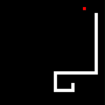

# CGame_Snake

经典游戏-贪吃蛇的 C++ 实现（使用 Qt5 绘制 GUI）

## 目标

## 贪吃蛇 AI

**移动策略** 

- 蛇首向 (UP or DOWN or LEFT or RIGHT) 的合法方向进行扩展，使用 A\* 算法判断下述两个条件：

  1. 该移动仍可保证存在蛇首向蛇尾靠拢的路径（保证蛇首不会进入死路）。

  2. 判断该移动能否保证蛇首抵达食物位置 ? 

     - 若该移动存在路径保证蛇首能抵达食物位置，则应是若干种选择中的最优选择（到达食物的步数最少）。
     - 若该移动不存在路径到达食物位置，则应是与蛇尾欧几里得距离最大。
- 对于每一步的移动，均使用上述策略决定蛇首的移动（即蛇身的移动）。

## 当前进度

基本完成贪吃蛇 AI 。可保证在绝大多数情况下走最优路径。

由于其路径选择的不规则性，当蛇身几乎填满全图时，无法吃完最后的几个漏洞。